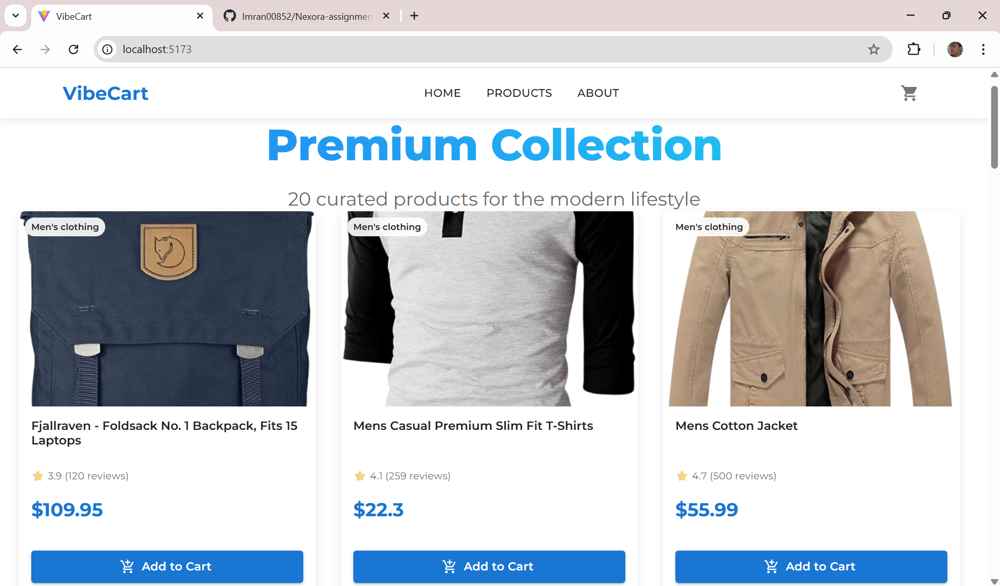
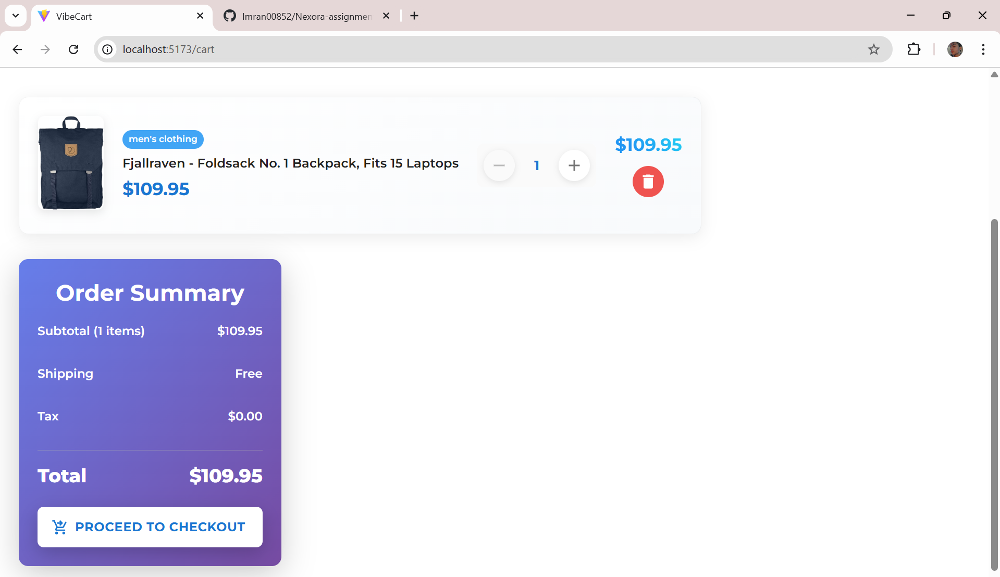
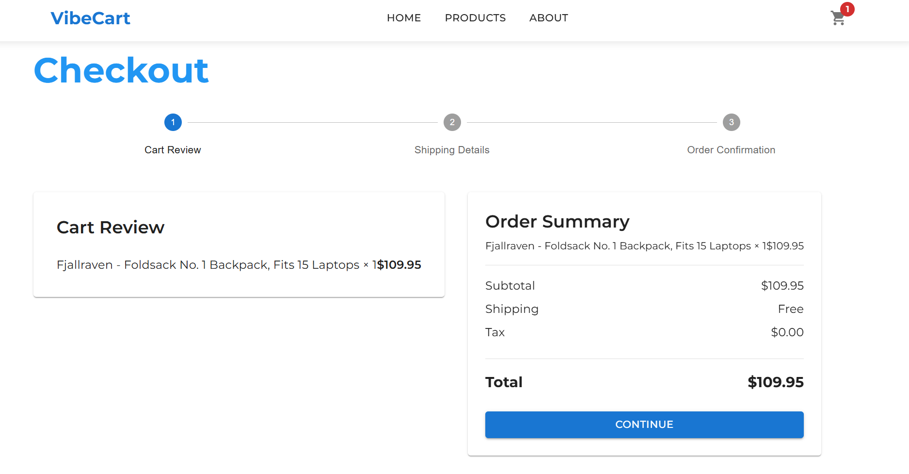
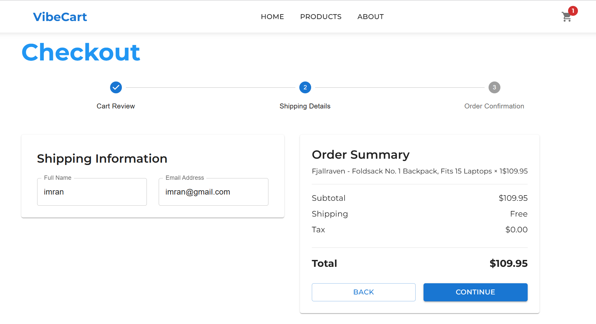
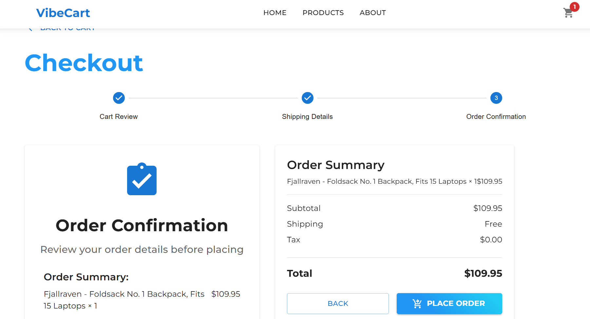

# 🛍️ E-Commerce MERN App(Nexora)

An elegant **E-Commerce Web Application** built with **React.js (MUI)** for the frontend and **Node.js + Express + MongoDB** for the backend.  
It fetches products from the [FakeStore API](https://fakestoreapi.com/) and stores them in the MongoDB database.

---

## 🚀 Tech Stack

### **Frontend**

- React.js
- Material UI (MUI)
- Redux Toolkit Query (for API fetching)
- React Hot Toast (for notifications)

### **Backend**

- Node.js
- Express.js
- MongoDB (Mongoose)
- dotenv
- Axios (for initial data fetching)

---

## ⚙️ Features

- ✅ Fetch products from FakeStore API and persist in MongoDB
- ✅ Beautiful, responsive product cards using **Material UI**
- ✅ Add to Cart, Update Cart, Remove from Cart, and Checkout APIs
- ✅ Toast notifications for cart actions
- ✅ Fully responsive design across all devices

---

## 📦 Folder Structure

```
ecom-backend/
├── config/
│   └── db.js
├── controllers/
│   └── product-cart-controllers.js
├── models/
│   └── product.js
├── routes/
│   └── routes.js
├── .env
├── index.js
└── utils/
    └── seeders.js
```

---

## 🔗 API Endpoints

| Method | Endpoint      | Description             |
| ------ | ------------- | ----------------------- |
| GET    | /api/products | Get all products        |
| POST   | /api/cart     | Add item to cart        |
| GET    | /api/cart     | Get user cart           |
| PUT    | /api/cart     | Update item quantity    |
| DELETE | /api/cart/:id | Remove item from cart   |
| POST   | /api/checkout | Checkout and clear cart |

---

## 🧩 Frontend Features (React + MUI)

- Product listing grid with **ProductCard** components
- Uniform, responsive product cards with hover effects
- Redux Toolkit Query for API calls
- Toast notifications using `react-hot-toast`
- Example:

  ```js
  const { data, isLoading } = useGetProductsQuery();
  ```

---

## 🖼️ UI Snapshots

### 🏠 Homepage – Product Grid



### 🛒 Cart Items



### 🧾Checkout





---

## 🧠 Setup Instructions

### 1️⃣ Backend Setup

```bash
cd ecom-backend
npm install
```

Create a `.env` file in the backend root:

```
PORT=5000
MONGO_URI=your_mongo_connection_string
FRONTEND_URL=http://localhost:3000
```

Seed initial products:

```bash
node utils/seeders.js
```

Run the backend:

```bash
npm run dev
```

### 2️⃣ Frontend Setup

```bash
cd ecom-frontend
npm install
npm start
```

Make sure your backend is running before starting the frontend.

---

## 👨‍💻 Developed By

**Imran Bhat**  
MERN Stack Developer  
💼 [LinkedIn](https://linkedin.com/in/imran00852)

---

> ⚡ _Built with React + MUI + Node.js for a seamless shopping experience._
